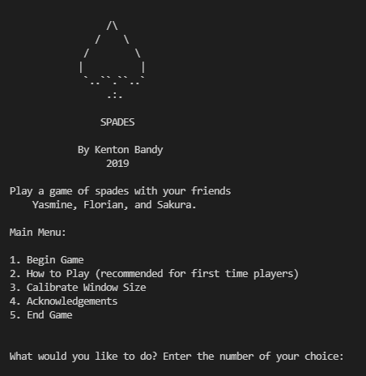
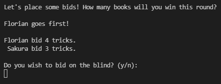
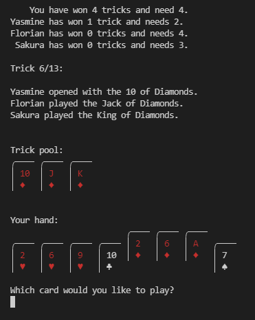
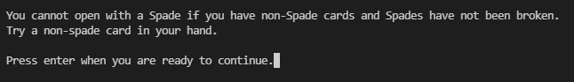
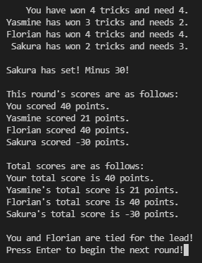

# spades
A single player text-based card game.

## How to play
(From the How to Play option in the main menu)  
You will need to enter text inputs to play this game. All you need to
do is follow the prompts to enter either the number of your bid or the
card you want to play and press enter.

In this game, you can use shorthand to type your card:
Ace of Spades = "as", 10 of Hearts = "10h", etc. You can also type out
the full name of the card if you wish.

## Rules
(From the How to Play option in the main menu)  
In this variant there are no teams - you are playing by yourself. The
first to 300 points wins the round. Sandbagging occurs when a player
has 5 or more points in the ones place of their total score, resulting
in a loss of 55 points. Players who exactly match their blind bid win
100 extra points, with a 100 point penalty if they do not meet their
blind bid.

## Features/Functionality/Appearance
- A deck is formed, shuffled, and distributed evenly to the four players.  
- In the first round, a random starting player is chosen. Subsequent rounds start with the player to the left. The player order is fixed (as it would be if players were sitting around a table).
- The user may opt to make a blind bid, and scoring is adjusted appropriately. The bots also occasionally make blind bids.

- The bot algorithm is admittedly predictable, but it works: bots will always play their best card if they need to win more tricks, and will always play their worst card if they have won enough tricks. A more sophisticated algorithm might play to the strengths of their hand and not play high cards when they cannot win the trick.

- When a bot initiates the trick, the playable cards from the user's hand are raised.
- During each round, the game keeps track of and displays the running count of tricks won for each player:  

- All input is validated and case insensitive. The game doesn't allow the user to make illegal plays and provides helpful, appropriate error messages:

- At the end of each round, the scores are tallied and calculated with a clear readout:

- The user can type "q" or "quit" at any time to end the program.

## Running Spades
Spades can be played from any command line interface (Windows, Mac, and Linux) while Python 3 is installed along with the following libraries:  
time  
random  
platform  
sys  
os  
signal

Once dependencies are installed, navigate to the spades folder and use
`python spades.py`

## Acknowledgements
Special thanks go to [Travis](https://github.com/thieman) and [Brian](https://github.com/farrspace) for being very generous with their help, suggestions, code review, encouragement, and positivity.

Thanks to Brian (again) for creating the spiffy card graphics and contributing
to the code.

Shout out to codecademy.com - I began this project while taking the codecademy python course. Codecademy is a little pricey if you're looking long term, but the python course and web-based editor are very nice.

Thanks to everyone who helped me develop this game by play testing it
and offering feedback.

## Additional info
As mentioned above, I began working on this project before finishing my first python course. Much of the functionality was written before I even knew what dictionaries were, and I had left the project long before I knew about the concept of loosely coupled code.  
Needless to say, this program is kind of a tangled mess and relies a lot on list indices making it difficult to edit, but it served its purpose and I had tons of fun making it. And it works (most of the time)!   
I am open to fixing major bugs, so reports are welcome, but I likely won't be doing any major refactors of this program as it has served its purpose as a learning exercise.  